# Portfolia

Portfolia is a full-stack portfolio management app built to track holdings, manage a watchlist, and explore performance analytics through a clean fintech-style dashboard.

It showcases modern full-stack development with secure authentication, protected routes, portfolio data management, and rich analytics UI.

## Live Demo

**Live App:** https://portfolia-wheat-gamma.vercel.app/

## What You Can Do

- Secure authentication with protected app routes
- Create, edit, and manage portfolio holdings
- Track watchlist assets and target prices
- Explore allocation, performance, and category analytics
- Review insights such as top holdings and portfolio win rate
- Manage account and workspace settings

## Tech Stack

- **Framework:** Next.js 16, React 19, TypeScript
- **Styling/UI:** Tailwind CSS v4, shadcn/ui, Lucide icons
- **Authentication:** Clerk
- **Security:** Arcjet
- **Database:** PostgreSQL, Drizzle ORM
- **Charts:** Recharts
- **Testing:** Vitest, Playwright

## Project Structure

```text
app/                  Route groups and pages
components/           Reusable UI and feature components
lib/db/               Database client, schema, and query layer
lib/security/         Request protection logic
drizzle/              SQL migrations
public/screenshots/   Product screenshots used in this README

## Screenshots

### Dashboard

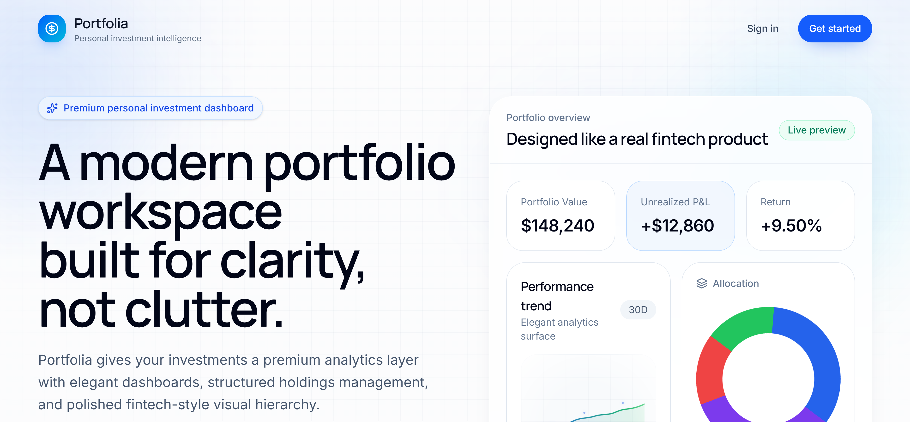
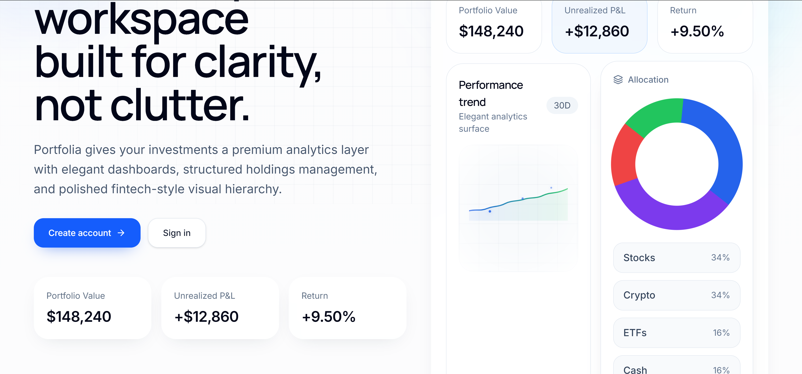

### Holdings

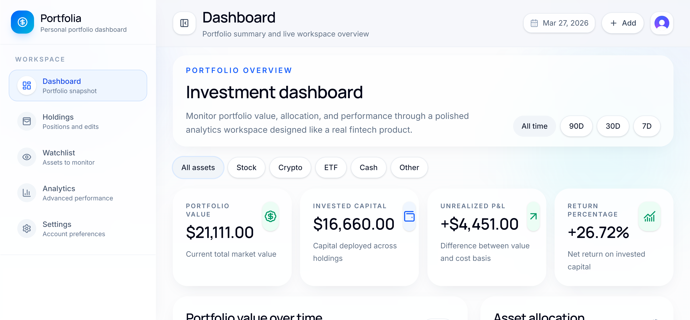
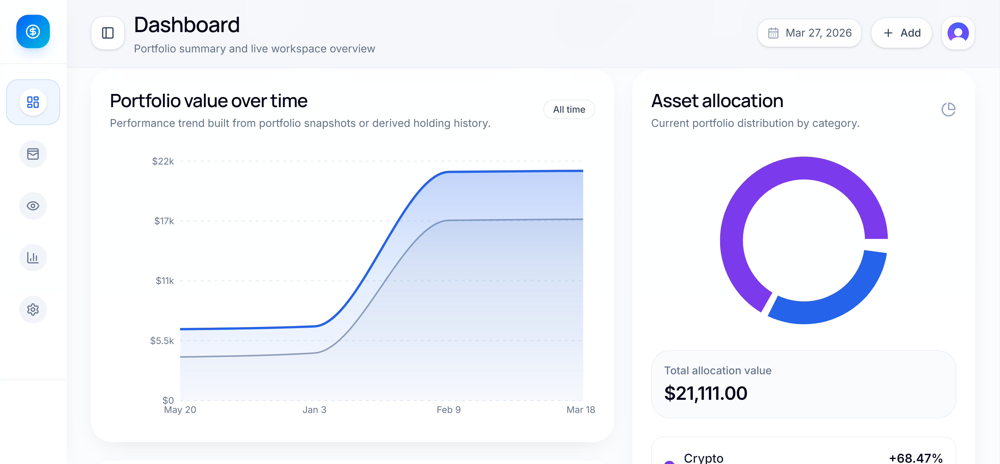

### Watchlist

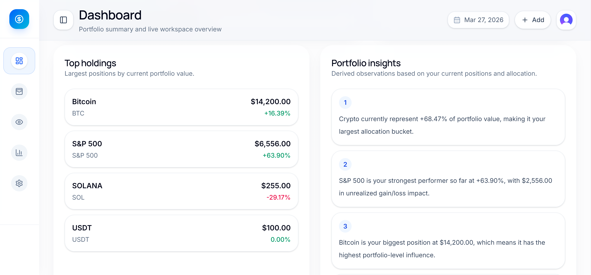
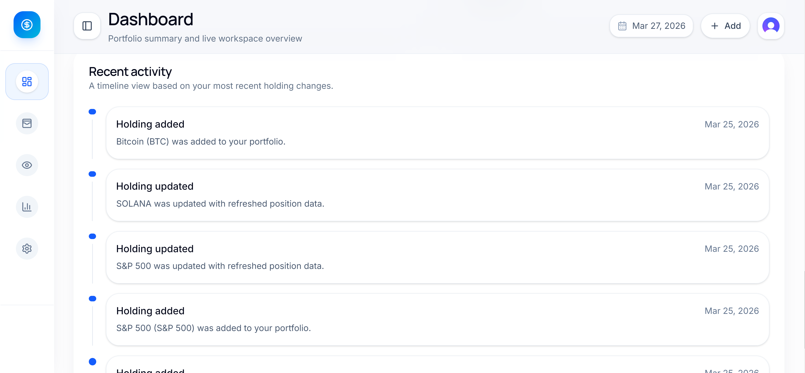

### Analytics

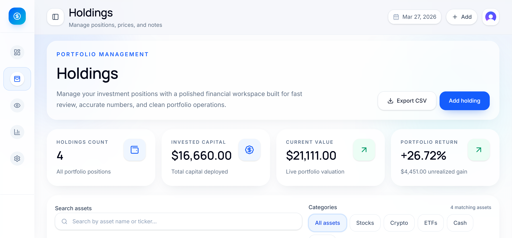
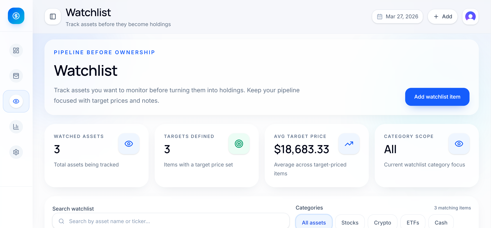
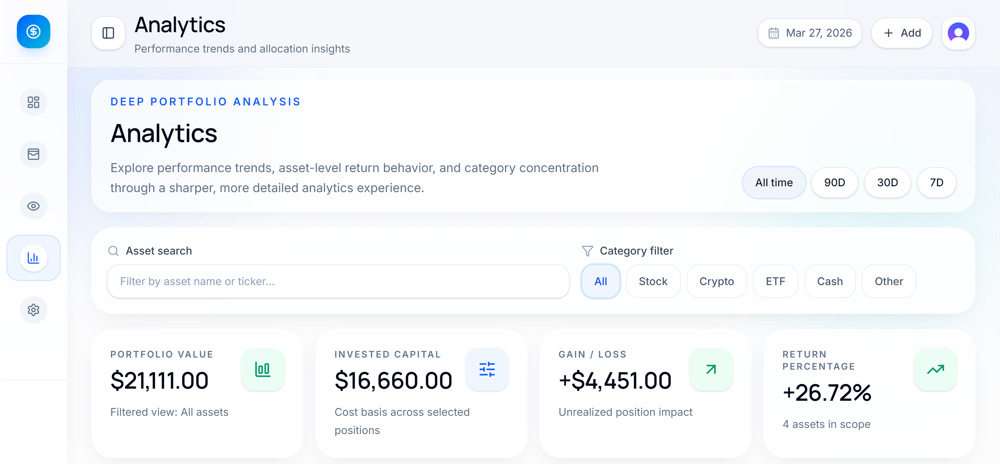
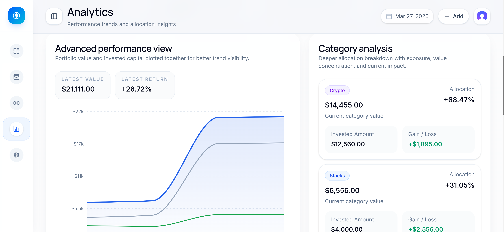
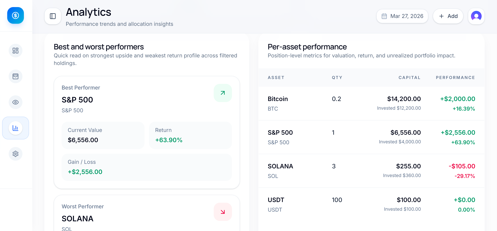

## Notes

- Protected routes are enforced in `proxy.ts` with Clerk middleware.
- Arcjet protections are applied through `lib/security/arcjet.ts`.
- Data access is scoped per authenticated user in `lib/db/queries.ts`.
