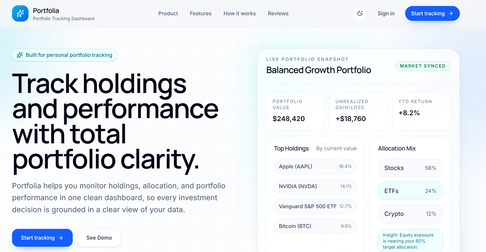
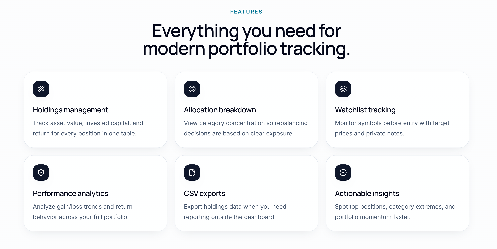
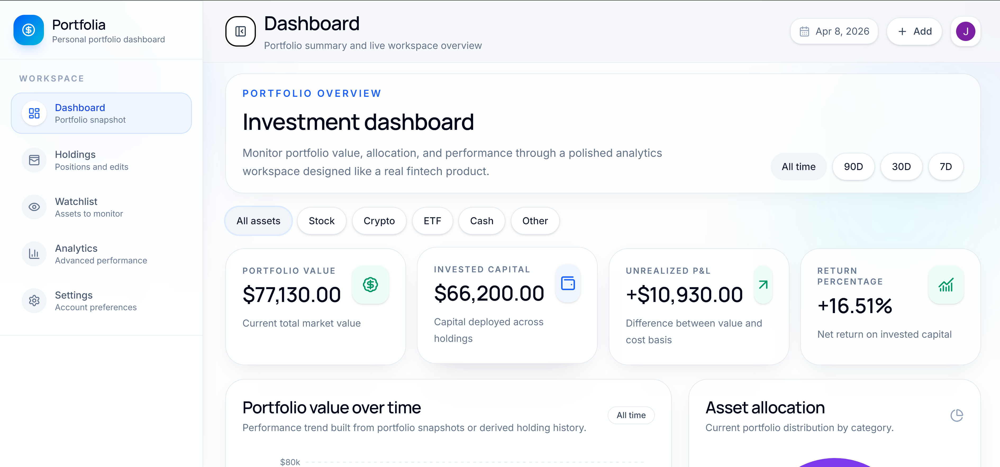
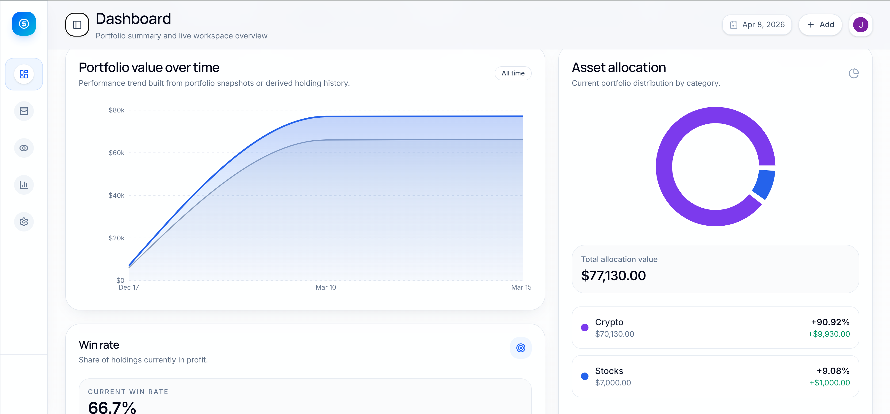
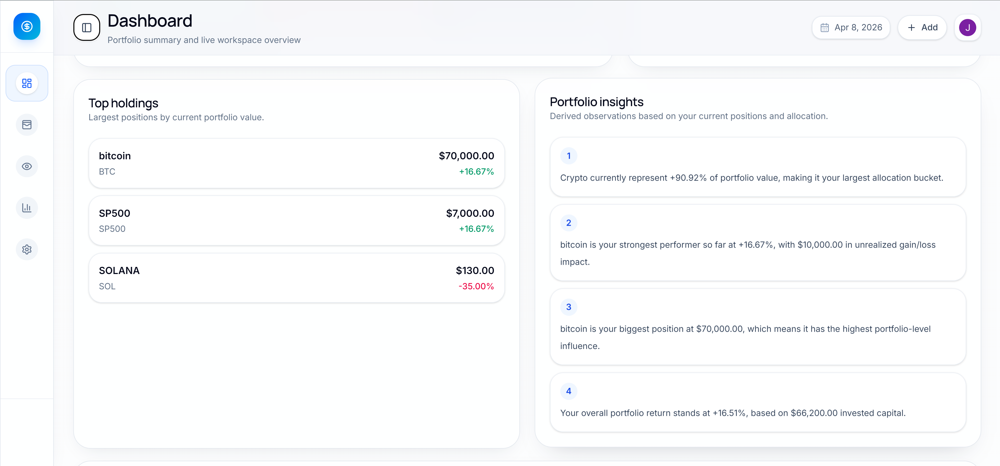
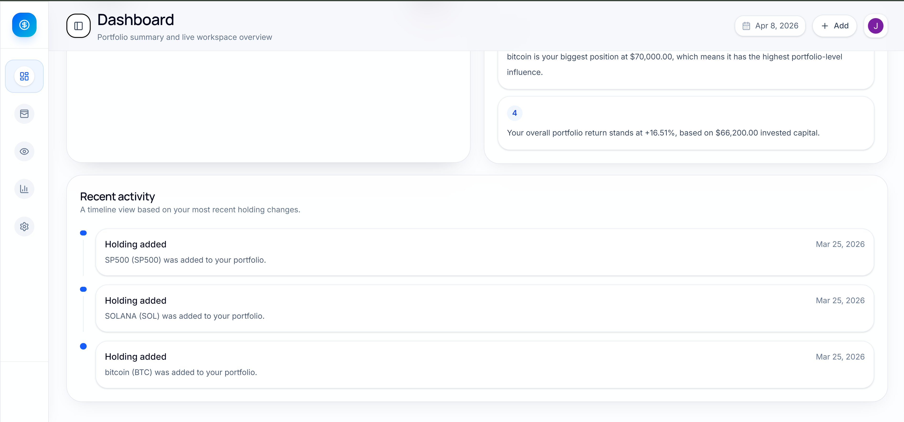
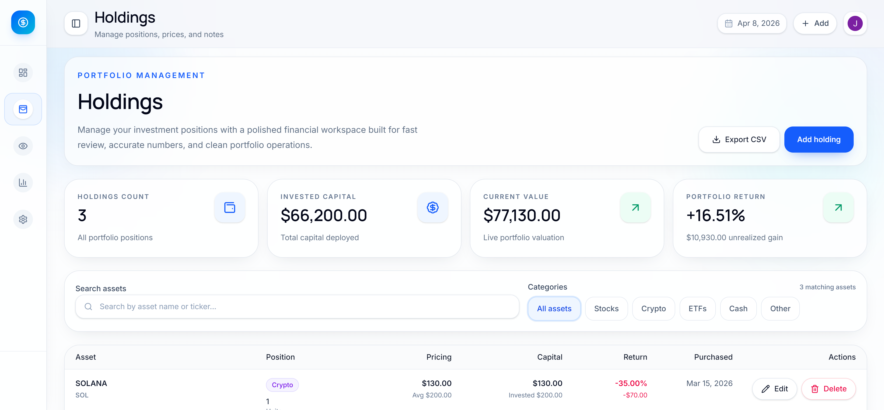
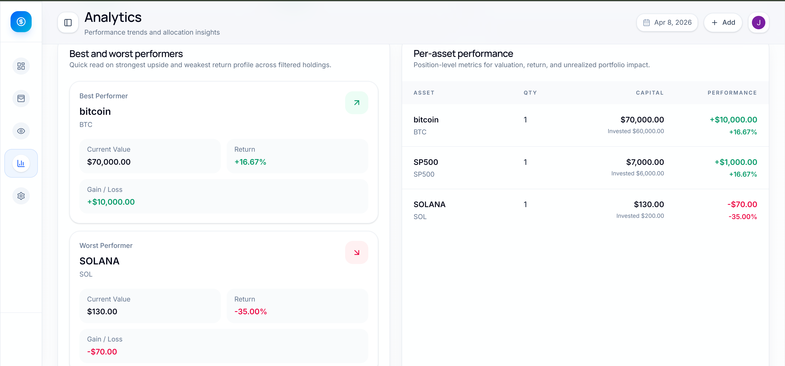

# Portfolia

**Portfolia** is a modern full-stack fintech-style portfolio tracking dashboard built for managing holdings, monitoring allocation, tracking watchlist assets, and understanding portfolio performance through clean analytics.

It demonstrates authentication, protected app routes, per-user portfolio data, holdings management, watchlist tracking, chart-driven analytics, CSV export, reusable UI architecture, testing, and production-minded fintech UI/UX.

[Live Demo](https://portfolia-wheat-gamma.vercel.app) · [Analytics Page](https://portfolia-wheat-gamma.vercel.app/analytics) · [Repository](https://github.com/skerdiD/Portfolia) · [Features](#features) · [Tech Stack](#tech-stack) · [Getting Started](#getting-started)

---

## Preview

### Live App

https://portfolia-wheat-gamma.vercel.app

### Dashboard Overview



### Dashboard Allocation



### Holdings Table



### Add Holding Dialog



### Watchlist Table



### Add Watchlist Asset Dialog



### Analytics Performance



### Analytics Allocation


### Analytics Categories


### Settings



---

## Overview

Most portfolio dashboards stop at simple numbers and static charts. Portfolia was built to feel closer to a real fintech SaaS product.

The app includes authenticated users, protected dashboard routes, holdings management, watchlist tracking, allocation analytics, performance insights, CSV export, account settings, reusable UI components, and a polished responsive interface.

The goal was not only to build a working investment tracker, but to show product thinking, data modeling, dashboard design, user experience, secure access, analytics UI, and business value.

---

## Features

### Authentication and Access

* Authentication with Clerk
* Protected dashboard routes
* Middleware-based route protection
* Secure access to dashboard, holdings, watchlist, analytics, and settings
* Per-user portfolio workspace

### Dashboard

* Portfolio overview cards
* Total portfolio value summary
* Allocation overview
* Recent activity and portfolio movement
* Top holdings preview
* Clean fintech-style dashboard layout

### Holdings Management

* Add portfolio holdings
* Edit existing holdings
* Manage asset details
* Track asset category/type
* View holdings inside a structured table
* Export holdings data to CSV
* Reusable forms and dialogs for portfolio workflows

### Watchlist

* Add assets to a watchlist
* Track assets without adding them to the active portfolio
* Manage target prices
* Organize assets being monitored
* Separate watchlist workflow from active holdings

### Analytics

* Portfolio performance analytics
* Allocation breakdown charts
* Category distribution charts
* Holdings insights
* Visual summaries powered by chart components
* Dedicated analytics page for deeper portfolio review

### Settings

* Account settings page
* Protected settings route
* Workspace/account preference structure
* Clean settings UI consistent with the rest of the app

### Security and Reliability

* Clerk authentication
* Protected routes through middleware
* Arcjet request protection
* Server-side data access patterns
* Environment-variable based configuration
* User-scoped portfolio data

### Performance and UX

* Responsive desktop and mobile layout
* Premium fintech-style interface
* Reusable component architecture
* Clean tables, dialogs, cards, and charts
* Smooth dashboard navigation
* Production build support

---

## Tech Stack

### Frontend

* Next.js 16
* React 19
* TypeScript
* Tailwind CSS v4
* shadcn/ui
* Lucide React
* Recharts

### Backend and Data Layer

* Next.js App Router
* PostgreSQL
* Drizzle ORM
* Neon serverless driver

### Auth, Security, and Infra

* Clerk
* Arcjet
* Vercel
* Environment-based secrets

### Testing and Tooling

* Vitest
* Playwright
* TypeScript compiler
* GitHub Actions

---

## Architecture Overview

Portfolia uses a modern full-stack architecture built around the Next.js App Router.

```txt
Client UI
  |-- Next.js App Router
  |-- React Components
  |-- Tailwind CSS / shadcn UI
  |-- Recharts Analytics
  |-- Tables, Cards, Dialogs

Auth Layer
  |-- Clerk Authentication
  |-- Protected Routes
  |-- Middleware Guards

Server/Data Layer
  |-- Server-Side Queries
  |-- Drizzle ORM
  |-- PostgreSQL / Neon
  |-- User-Scoped Data Access

Security Layer
  |-- Arcjet Protection
  |-- Environment Variables
  |-- Route Protection

Quality Layer
  |-- TypeScript
  |-- Vitest
  |-- Playwright
  |-- GitHub Actions
```

The app keeps portfolio data scoped to the authenticated user, organizes investment data into focused dashboard sections, and presents insights through reusable UI components and analytics charts.

---

## Product Flow

1. A user visits the landing page.
2. The user signs in with Clerk.
3. The user enters the protected dashboard.
4. The user adds portfolio holdings.
5. The dashboard summarizes value, allocation, and performance.
6. The user tracks potential assets in the watchlist.
7. The analytics page gives deeper portfolio insights.
8. The user can export holdings data to CSV.
9. Settings provide a protected place for account and workspace preferences.

---

## Core Sections

### Dashboard

The dashboard gives users a high-level view of their portfolio value, allocation, top holdings, and overall portfolio activity.

### Holdings

The holdings workspace is where users manage active investment positions using forms, dialogs, tables, and structured asset data.

### Watchlist

The watchlist helps users monitor assets they are interested in without adding them to their active portfolio.

### Analytics

The analytics page focuses on deeper insight, including allocation, category distribution, and performance-focused chart views.

### Settings

The settings page gives users a clean protected area for account and app-related preferences.

---

## Getting Started

### 1. Clone the repository

```bash
git clone https://github.com/skerdiD/Portfolia.git
cd Portfolia
```

### 2. Install dependencies

```bash
npm install
```

### 3. Create environment variables

Create a `.env.local` file in the root of the project.

```env
NEXT_PUBLIC_CLERK_PUBLISHABLE_KEY=
CLERK_SECRET_KEY=

DATABASE_URL=

ARCJET_KEY=
```

### 4. Push or migrate the database schema

```bash
npm run db:push
```

If the project uses migrations instead, run the migration command configured in the repository.

### 5. Start the development server

```bash
npm run dev
```

Open the app at:

```txt
http://localhost:3000
```

---

## Available Scripts

```bash
npm run dev          # Start the development server
npm run build        # Create a production build
npm run start        # Start the production server
npm run lint         # Run ESLint
npm run typecheck    # Run TypeScript checks
npm run test         # Run Vitest tests
npm run test:e2e     # Run Playwright E2E tests
npm run db:push      # Push schema changes to the database
```

---

## Testing and Quality

Portfolia includes automated checks to help protect the most important product flows.

The project uses:

* **Vitest** for focused logic and component-level tests
* **Playwright** for browser-level flows
* **TypeScript** for type safety
* **Production builds** to confirm deployment readiness
* **GitHub Actions** for CI workflow support

Run the main quality checks:

```bash
npm run typecheck
npm run test
npm run build
```

If E2E tests are configured:

```bash
npm run test:e2e
```

---

## Project Highlights

Portfolia shows experience with more than static dashboard UI.

It demonstrates:

* Full-stack fintech dashboard development
* Authenticated user experiences
* Protected app routes
* Per-user portfolio data management
* Holdings and watchlist workflows
* Data visualization with charts
* CSV export functionality
* Reusable component architecture
* Clean table and dialog UX
* Dashboard analytics thinking
* Production-ready UI polish
* Testing and deployment preparation

---

## Project Structure

```txt
Portfolia/
├── .github/workflows/      CI / workflow files
├── app/                    App Router pages and route groups
├── components/             Reusable UI and feature components
├── drizzle/                Database migrations
├── lib/                    DB, queries, utilities, and security helpers
├── public/                 Static assets and screenshots
├── tests/                  Automated tests
├── proxy.ts                Clerk route protection
├── package.json
└── README.md
```

---

## Business Value

Portfolia represents the type of financial dashboard that individual investors, freelancers, creators, and small teams can use to understand their assets more clearly.

From a business perspective, this project supports:

* Better investment organization
* Clear portfolio visibility
* Faster review of holdings and allocation
* Easier tracking of watchlist assets
* Cleaner financial reporting through CSV export
* Better decision-making through analytics
* A foundation for a paid fintech-style SaaS product

The strongest business value is not only the holdings table itself, but the system around it: authentication, portfolio data ownership, analytics views, export functionality, reusable dashboard components, and a polished interface that can grow into a real investment tracking platform.

---

## Author

Built by **skerdiD**.

GitHub: [@skerdiD](https://github.com/skerdiD)
