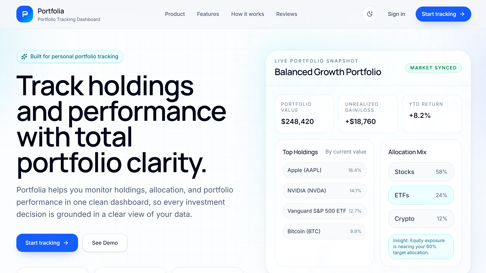
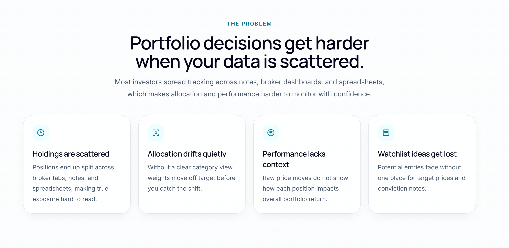
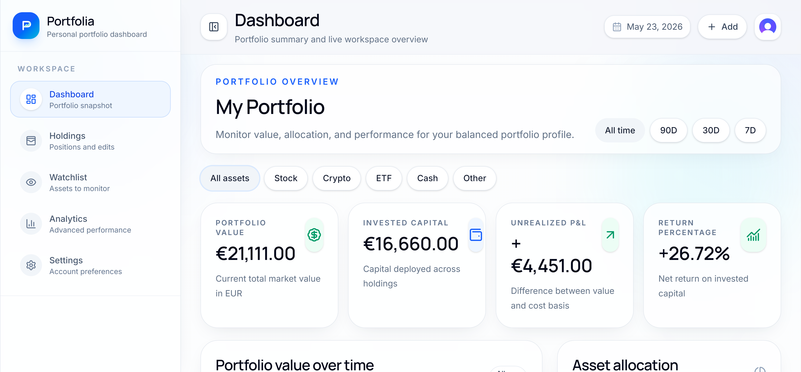
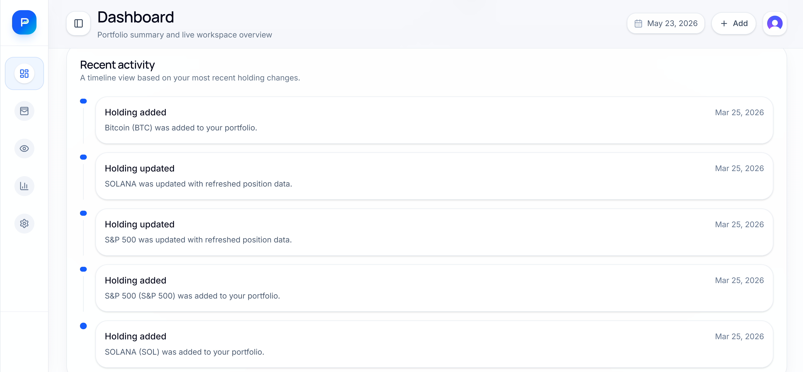
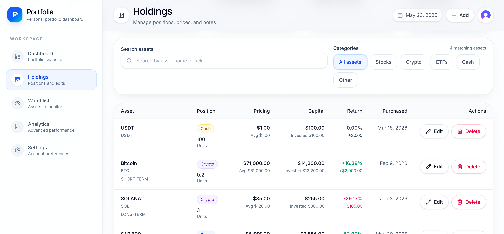
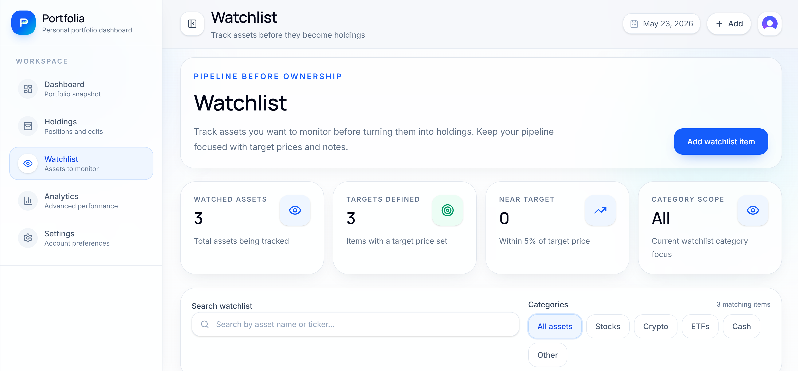
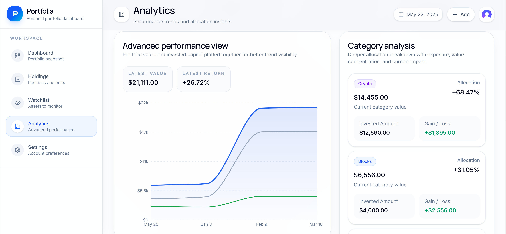
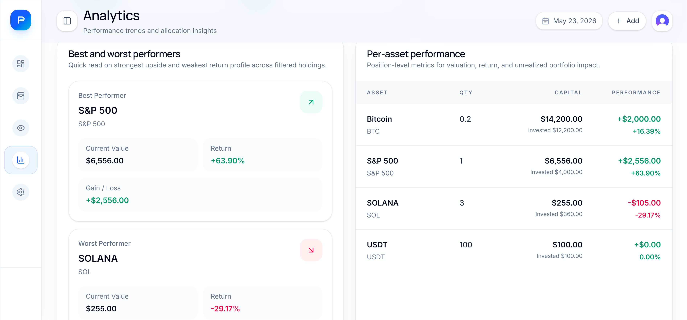

# Portfolia

**Portfolia** is a modern full-stack fintech-style portfolio tracking dashboard for managing holdings, monitoring allocation, tracking watchlist assets, and understanding portfolio performance through clean analytics.

It helps users organize investment positions, review portfolio value, track assets, analyze allocation, export holdings, and manage their account inside a protected SaaS-style dashboard.

[Live Demo](https://portfolia-skerdid.vercel.app/) | [Repository](https://github.com/skerdiD/Portfolia)

---

## Preview

### Landing Page



### Landing Problem Section



### Dashboard Summary



### Dashboard Activity



### Holdings Management



### Watchlist



### Analytics Performance



### Analytics Assets



---

## Overview

Many portfolio dashboards only show basic numbers and static charts. Portfolia was built to feel closer to a real fintech SaaS product.

The app includes authentication, protected dashboard routes, holdings management, watchlist tracking, allocation analytics, performance insights, CSV export, account settings, reusable UI components, and a polished responsive interface.

This project demonstrates full-stack product thinking, authenticated user experiences, database-backed portfolio workflows, chart-driven analytics, clean UI architecture, testing, security, and production-minded engineering.

---

## Key Features

### Portfolio Dashboard

- View total portfolio value and performance summaries
- Review allocation, top holdings, and recent portfolio activity
- Navigate a clean fintech-style dashboard
- See portfolio data through cards, tables, and charts

### Holdings Management

- Add and manage portfolio holdings
- Track asset name, symbol, quantity, price, category, and value
- Edit holdings through reusable dialogs and forms
- View holdings inside a structured table
- Export holdings data to CSV

### Watchlist

- Add assets to a watchlist without adding them to the active portfolio
- Track target prices and monitored assets
- Manage watchlist items separately from portfolio holdings
- Keep potential investments organized

### Analytics

- Analyze portfolio performance
- View allocation breakdowns
- Review category distribution charts
- Understand portfolio structure through visual insights
- Use a dedicated analytics page for deeper review

### Authentication and Access

- Clerk authentication
- Protected app routes
- Middleware-based route protection
- User-scoped portfolio data
- Secure access to dashboard, holdings, watchlist, analytics, and settings

### Security and Reliability

- User-specific portfolio records
- Protected server-side data access
- Arcjet request protection
- Environment-variable based configuration
- Type-safe database access with Drizzle
- CI checks for linting, testing, typechecking, and production builds

---

## Tech Stack

### Frontend

- Next.js App Router
- React
- TypeScript
- Tailwind CSS
- shadcn/ui
- Lucide React
- Recharts

### Backend and Database

- Next.js Server Components
- Server-side data access
- Drizzle ORM
- PostgreSQL
- Neon serverless driver

### Auth, Security, and Deployment

- Clerk
- Arcjet
- Vercel
- Environment variables

### Testing and Tooling

- Vitest
- Playwright
- GitHub Actions
- TypeScript
- ESLint

---

## Architecture Overview

Portfolia uses a full-stack Next.js architecture with Clerk for authentication, Drizzle for typed database access, PostgreSQL for portfolio data, and Recharts for analytics visualization.

```txt
Next.js App
  |-- App Router
  |-- React
  |-- TypeScript
  |-- Tailwind CSS
  |-- Landing Page
  |-- Dashboard
  |-- Holdings
  |-- Watchlist
  |-- Analytics
  |-- Settings

Auth Layer
  |-- Clerk Authentication
  |-- Protected Routes
  |-- Middleware Guards
  |-- User-Scoped Access

Server and Data Layer
  |-- Server Components
  |-- Server-Side Queries
  |-- Drizzle ORM
  |-- PostgreSQL
  |-- Neon Database

Analytics Layer
  |-- Portfolio Value Summaries
  |-- Allocation Charts
  |-- Category Distribution
  |-- Performance Views
  |-- CSV Export

Security and Quality Layer
  |-- Arcjet Protection
  |-- Environment Variables
  |-- TypeScript
  |-- Vitest
  |-- Playwright
  |-- GitHub Actions CI
```

---

## Getting Started

### 1. Clone the repository

```bash
git clone https://github.com/skerdiD/Portfolia.git
cd Portfolia
```

### 2. Install dependencies

```bash
npm install
```

### 3. Create environment variables

Create a `.env.local` file in the root of the project.

```env
NEXT_PUBLIC_CLERK_PUBLISHABLE_KEY=
CLERK_SECRET_KEY=

DATABASE_URL=

ARCJET_KEY=
```

### 4. Push the database schema

```bash
npm run db:push
```

### 5. Start the development server

```bash
npm run dev
```

Open the app at:

```txt
http://localhost:3000
```

---

## Available Scripts

```bash
npm run dev          # Start the development server
npm run build        # Create a production build
npm run start        # Start the production server
npm run lint         # Run ESLint
npm run typecheck    # Run TypeScript checks
npm run test         # Run Vitest tests
npm run test:e2e     # Run Playwright E2E tests
npm run db:push      # Push schema changes to the database
```

---

## Project Highlights

Portfolia shows experience with more than static dashboard UI.

It demonstrates:

- Full-stack fintech dashboard development
- Authenticated user experiences
- Protected application routes
- User-scoped portfolio data
- Holdings and watchlist workflows
- Data visualization with charts
- CSV export functionality
- Reusable component architecture
- Clean table, card, and dialog UX
- Production-ready UI polish
- Testing and deployment preparation

---

## Author

Built by **skerdiD**.

GitHub: [@skerdiD](https://github.com/skerdiD)