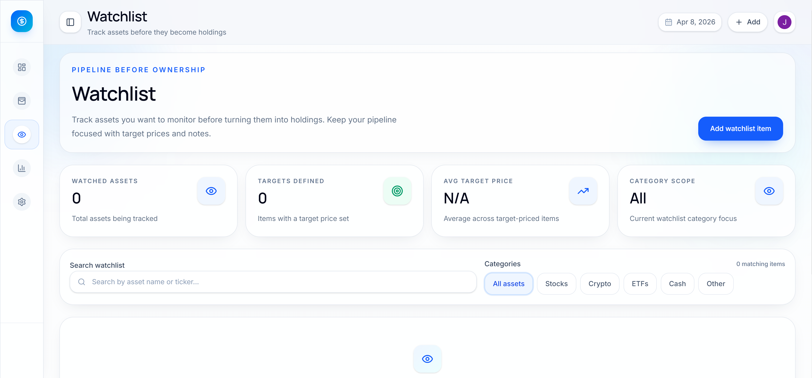
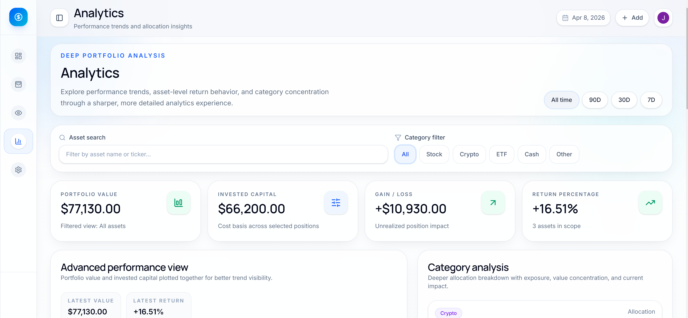

# Portfolia

Modern portfolio tracking dashboard for managing holdings, monitoring allocation, and understanding portfolio performance.

Portfolia is a full-stack fintech-style web app built to help users track investments through a clean dashboard, detailed holdings management, watchlist tracking, and performance analytics.

---

## Live Demo

- **Live App:** https://portfolia-wheat-gamma.vercel.app
- **Analytics Page:** https://portfolia-wheat-gamma.vercel.app/analytics
- **Repository:** https://github.com/skerdiD/Portfolia

---

## Screenshots

### Dashboard


### Holdings


### Watchlist


### Analytics




### Settings


---

## What You Can Do

- Sign in securely and access protected portfolio routes
- Add, edit, and manage portfolio holdings
- Track watchlist assets and target prices
- View portfolio allocation and performance analytics
- Review top holdings and portfolio insights
- Export holdings data to CSV
- Manage account and workspace settings
- Explore a clean fintech-style dashboard built with reusable UI components

---

## Core Sections

### Dashboard
Get a high-level view of portfolio value, allocation, trends, and recent portfolio activity.

### Holdings
Manage investment positions with forms, tables, and structured portfolio data.

### Watchlist
Track assets you are monitoring without adding them to your active portfolio.

### Analytics
Understand allocation, category split, and overall portfolio performance through charts and summary views.

### Settings
Manage account and app-related preferences inside a protected workspace.

---

## Tech Stack

### Frontend
- Next.js 16
- React 19
- TypeScript
- Tailwind CSS v4
- shadcn/ui
- Lucide React
- Recharts

### Backend / Data Layer
- Next.js App Router
- PostgreSQL
- Drizzle ORM
- Neon serverless driver

### Auth / Security
- Clerk authentication
- Protected routes via middleware
- Arcjet request protection

### Testing
- Vitest
- Playwright

---

## Project Highlights

- **Protected app routes** for dashboard, holdings, watchlist, analytics, and settings
- **Per-user portfolio data management**
- **Chart-driven analytics UI** for performance and allocation
- **Reusable component architecture** across dashboard sections
- **CSV export support** for holdings workflows
- **Portfolio-grade UI polish** with a fintech-style visual direction

---

## Project Structure

```text
Portfolia/
├── .github/workflows/      CI / workflow files
├── app/                    App Router pages and route groups
├── components/             Reusable UI and feature components
├── drizzle/                Database migrations
├── lib/                    DB, queries, utilities, and security helpers
├── public/                 Static assets and screenshots
├── tests/                  Automated tests
├── proxy.ts                Clerk route protection
├── package.json
└── README.md
